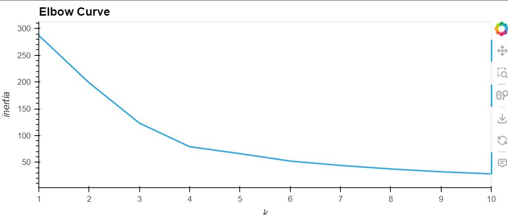
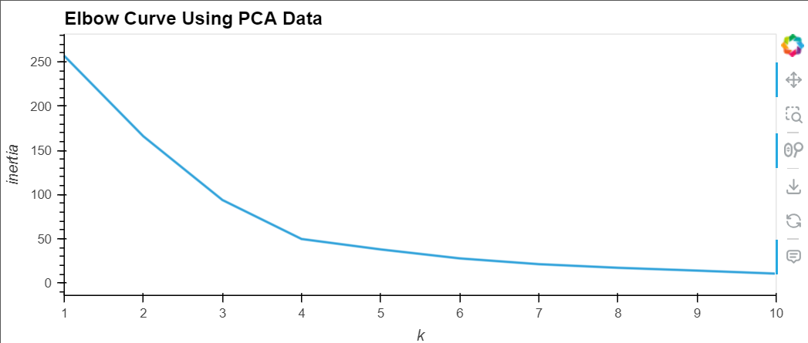
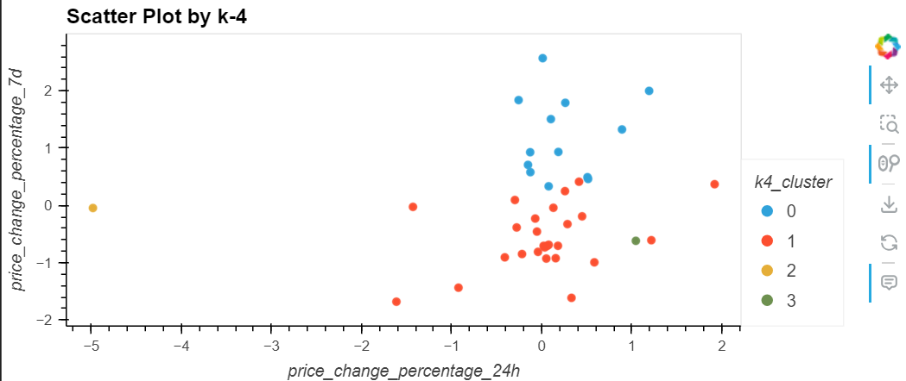
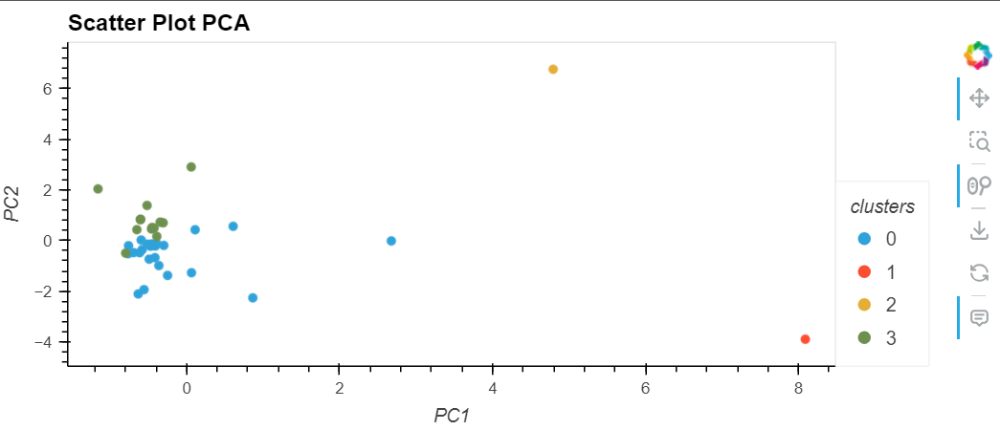

# CryptoClustering
## Overview
The goals of this project are to predict if cryptocurrencies are affected by 24 hour or 7 day changes using unsupervised learning. To accomplish this k-means and pca clustering are used.
## Overview of files
Inside of the CryptoClustering file there is a code, graphs, and resources file.
### Code
This contains the code to accomplish the project
### Graphs
This contains the 4 graphs created in the project
### Resources
This contains the csv file containing the data used in this project.
## Steps
-Load in and transform and scale the data
-Using the elbow method find the best value for k
-Cluster the data based on the best value of k
-Use PCA to go to three features
-Find the best k value for the pca data
-Cluster the pca data from the best k value
-Compare and analyze the data
## Results
The elbow curve graph with the orignal data

The elbow curve graph with pca data

Scatter plot with original data and k=4

Scatter plot with pca data and k=4

